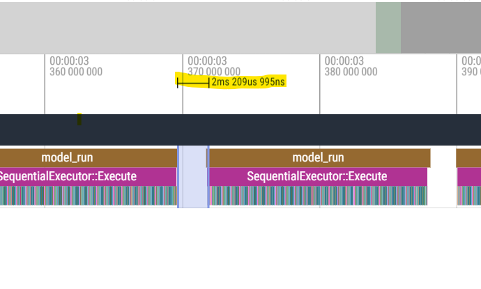

# GPT-SOVITS-ONNX-RS

本项目旨在使用 **Rust** 与 **ONNX Runtime** 将 GPT-SoVITS（V2 版本）部署至任意支持 x86 或 ARM 架构的 CPU 设备上。
目前暂不支持 V3/V4 版本，原因在于其计算复杂度较高，尚难在通用 CPU 上实现令人满意的实时性能。


项目将作为个人全平台chatbot（尚未开源）的TTS引擎，为在Android/PC侧实现低延迟、高可用的TTS能力。后续将围绕实时性进行优化（可能牺牲更大的精度）。

如果后续出现了更加高效的实现（比如如果出现了MNN/ExecuTorch的实现，且效果更好也更快），本项目将停止开发。

⚠️ 注意，当前项目仍处于开发阶段，API和效果仍不稳定，将在chatbot的后续开发中更改、逐渐修复和优化

---

## Demo Video on Android

源代码：[gpt-sovits-android-demo](https://github.com/null-define/gpt-sovits-android-demo/tree/master)
演示机为IQOO13，推理时间因不同SOC和机型可能差距较大。目前英文效果较差，且仍存在偶现输出提前停止。


https://github.com/user-attachments/assets/41260271-2af5-4fbc-af5f-1dad7f48aec9


## 当前问题

1. 英文/中英混合能力较差，目前部分采用了GPT-SoVITS-Rust的逻辑，使用G2pw处理中文，在一定程度上有所改善，但是仍有差距。
2. 输出效果稳定性仍较差。
3. 由于ORT的设计，部分kvcache的拷贝在不修改ORT的前提下无法优化，这个拷贝将每个迭代阻塞了2ms。


## 性能信息

参考 [perf_record](doc/perf_record.md)

## 项目组件

本项目包含以下核心部分：

1. **Rust 推理运行时**：适用于构建 x86/ARM 平台的推理可执行程序。
2. **模型转换与优化脚本**：位于 `scripts` 目录，支持一键导出与优化 SoVITS 模型（注意新的模型结构和官方默认结构不兼容，需要拷贝完整脚本进行转换）。
3. **Android 构建支持脚本**：由于 `ort-rs` 官方不提供 Android 的预构建包，需用户自行构建 ONNX Runtime。

本项目基于 [mzdk100/GPT-SoVITS](https://github.com/mzdk100/GPT-SoVITS) 开发和改进，目标是在中高端 x86/ARM CPU 上，通过 ONNX Runtime 实现可接受延迟的 TTS 体验。

---

## 方案对比（当前情况）

| 方案                                                                   | TTS 效果                 | 性能                     | 平台兼容性              | 易用性                         |
| -------------------------------------------------------------------- | ---------------------- | ---------------------- | ------------------ | --------------------------- |
| **sherpa-onnx**                                                      | ★★★☆☆（情感表达）      | ★★★★★（模型小，可实时）    | ★★★★★（全平台）         | ★★★★★（全平台预构建）             |
| **[GPT-SoVITS-Rust](https://github.com/second-state/gpt_sovits_rs)** | ★★★★★（接近原版效果）     | ★★★★☆（Torch）      | ★★☆☆☆（目前不支持 Android） | ★★★☆☆（需手动）              |
| **本项目（GPT-SOVITS-ONNX-RS）**                                      | ★★☆☆☆（与原版有差距，不稳定）            | ★★★★☆（ONNX，+优化转换脚本） | ★★★☆☆（支持 ARM/x86）  | ★★★★☆（Android 需手动） |

---

## 使用建议（当前情况）

* ✅ **Android 平台 + 高性能需求**：推荐使用 `sherpa-onnx`
* ✅ **x86 平台（Linux/Windows, CUDA/CPU）+ 高拟真度需求**：推荐 [`GPT-SoVITS-Rust`](https://github.com/second-state/gpt_sovits_rs)
* ✅ **Android 平台 + x86（CPU）+ 高拟真需求**：可以使用本项目（GPT-SOVITS-ONNX-RS）

---

## 构建指南

### 模型转换 

参考 [scripts/Readme.md](scripts/README.md)

### x86 平台构建

直接使用 Cargo 编译即可：

```bash
cargo build --release
```

---

### Android 平台构建

> ⚠️ 为保持 ONNX Runtime 的更新与兼容性，**本项目不提供预构建二进制文件**，需用户自行构建。

构建步骤如下：

1. 安装 CMake ≥ 3.28（建议使用 Conda 环境安装以绕过旧系统限制）。
2. 下载并配置 Android NDK 与 SDK，设置必要的环境变量。
3. 运行 `build_for_android.sh`，一键生成下载onnxruntime源代码，编译onnxruntime，并编译 Android 平台下的可执行程序和动态库。
4. 后续构建，可以直接使用cargo build --target aarch64-linux-android --release --features jni  --examples

---

## 实验性：其他 EP / Runtime 支持

借助 ONNX 的良好兼容性，你可以尝试使用不同的执行后端（Execution Provider）或运行时引擎运行模型。以下为当前已测试的组合：

### Execution Provider（EP）

* ⚠️ **NNAPI**：所有模型结构均可运行，但无论fp16/fp32未观察到明显性能提升。（Google官方已经不建议使用NNAPI）
* ✅ **XNNPACK**：可以使用XNNPACK的EP运行decoder模型，但在IQOO13未见明显加速。（但结论不一定对所有平台生效）

### ONNX 替代 Runtime

* ❌ **MNN**：模型可转换，使用MNN 3.2.0 C++ API，可以正常载入转换之后的模型，但运行时，decoder的x_example无法被session分配有效内存，或者直接缺失输入（取决于使用onnx原模型或者optimize_aio.py脚本之后的模型，可能是MNN的BUG）， 因个人时间/能力有限，暂时放弃MNN方案。

---

如有问题或建议，欢迎通过 Issue 反馈。欢迎贡献代码或改进方案！
